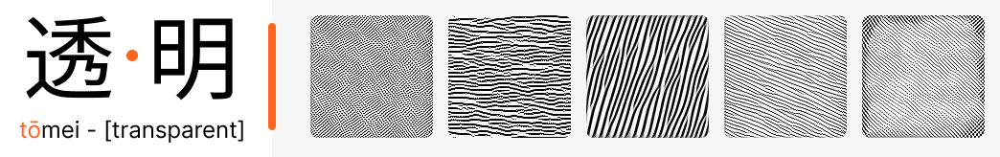

<div id="top"></div>

<!-- PROJECT LOGO -->
<br />
<div align="center">
  <a href="https://github.com/LuanAdemi/toumei">
    
  </a>

<h3 align="center">Toumei (透明)</h3>

  <p align="center">
    A interpretability library for pytorch
    <br />
    <a href="https://github.com/LuanAdemi/toumei"><strong>Explore the docs »</strong></a>
    <br />
    <br />
    <a href="https://github.com/LuanAdemi/toumei/tree/master/experiments">View Examples</a>
    ·
    <a href="https://github.com/LuanAdemi/toumei/issues">Report Bug</a>
    ·
    <a href="https://github.com/LuanAdemi/toumei/issues">Request Feature</a>
  </p>
</div>


<!-- TABLE OF CONTENTS -->
<details>
  <summary>Table of Contents</summary>
  <ol>
    <li>
      <a href="#about-the-project">About The Project</a>
      <ul>
        <li><a href="#built-with">Built With</a></li>
      </ul>
    </li>
    <li>
      <a href="#getting-started">Getting Started</a>
      <ul>
        <li><a href="#prerequisites">Prerequisites</a></li>
        <li><a href="#installation">Installation</a></li>
      </ul>
    </li>
    <li><a href="#usage">Usage</a></li>
    <li><a href="#contributing">Contributing</a></li>
    <li><a href="#license">License</a></li>
    <li><a href="#contact">Contact</a></li>
    <li><a href="#references">References</a></li>
  </ol>
</details>


<!-- ABOUT THE PROJECT -->
## About The Project
> This is in active development so the README might be outdated and is not listing all things currently implemented. *See the dev branch for more information.*


Toumei is a little sideproject of mine, trying to combine state of the art interpretability and model editing methods into a pythonic library. The goal is to compile useful methods into a coherent toolchain and make complexe methods accessible using a intuitive syntax. 

I think interpretability methods became quite powerful and therefore useful in the last couple years, wanting me to provide a library for broader use of these methods.


  
Following methods are currently or will be implemented:
<br><br>
- [x] [Feature Visualization](https://distill.pub/2017/feature-visualization/) **(1)**
    - [x] various image parameterization methods (Pixel, FFT, CPPN, etc.)
    - [x] transformation robustness and total variance regularization
    - [x] custom objective building
    - [x] joint optimization
    - [x] activation difference optimization (for e. g. styletransfer)
- [x] [Causal Tracing and Rank-One model editing](https://rome.baulab.info/) **(1)**
    - [x] causal tracing for huggingface like transformer objects
    - [ ] rank-one model editing (WIP)
- [ ] [Unified Feature Attribution](https://distill.pub/2020/attribution-baselines/) **(1)**
    - [ ] LIME (WIP)
    - [ ] DeepLift (planned)
    - [ ] SHAP methods (planned)
    - [ ] Circuit detection using feature atribution (research idea)
- [x] [Modularity](https://www.lesswrong.com/tag/modularity/) **(1 & 4)**
    - [x] [Measuring Modularity of MLPs](https://arxiv.org/pdf/2110.08058.pdf)
    - [ ] [Measuring Modularity of CNNs](https://arxiv.org/pdf/2110.08058.pdf) (WIP)
    - [ ] [Investigate (randomly) modulary varying goals in modern deep learning architectures](https://www.lesswrong.com/posts/99WtcMpsRqZcrocCd/ten-experiments-in-modularity-which-we-d-like-you-to-run) (research project)


**I am planning to add new things as I learn about them in the future, so this project basically mirrors my progress in the field of AI Interpretability.**


### Built With


<!-- GETTING STARTED -->
## Getting Started

Toumei **can not** be installed using `pip`. To use toumei by running the experiments or adding it to your projects, please follow the guide below.

### Prerequisites

Make sure the following libraries are installed or install them using 
```sh
pip install pytorch torchvision tqdm matplotlib transformers seaborn
```

### Installation
1. Clone the repo
   ```sh
   git clone https://github.com/LuanAdemi/toumei.git
   ```
2. Run the experiments
   ```sh
   cd toumei/experiments
   python <experiment>.py
   ```
3. Move the library to your project
   ```sh
   cd ..
   cp toumei <path_to_your_project>
   ```

<p align="right">(<a href="#top">back to top</a>)</p>


<!-- USAGE EXAMPLES -->
## Usage

### Simple feature visualization
In order to perform feature visualization on a convolutional model we are going to need two things: a image parameterization method and an objective.

These are located in the `toumei.cnn` package.

```python
import torch
import torchvision.transforms as T

# import toumei
import toumei.cnns.objectives as obj
import toumei.cnns.parameterization as param
```
Next, we are going to import a model we can perform feature visualization on
```python
from toumei.models import Inception5h

# the model we want to analyze
model = Inception5h(pretrained=True)

```
To counter noise in the optimization process, we are going to define a transfrom function used to perfom transformation robustness regularization
```python
# compose the image transformation for regularization through transformations robustness
transform = T.Compose([
    T.Pad(12),
    T.RandomRotation((-10, 11)),
    T.Lambda(lambda x: x*255 - 117)  # inception needs this
])
```
We are now able to define our objective pipeline using a image parameterization method (here FFT) and our objective (visualize unit mixed3a:74)

```python

# define a feature visualization pipeline
fv = obj.Pipeline(
    # the image generator object
    param.Transform(param.FFTImage(1, 3, 224, 224), transform),

    # the objective function
    obj.Channel("mixed3a:74")
)

```
Finally, we are going to optimize our pipeline and plot the results
```python

# attach the pipeline to the model
fv.attach(model)

# send the objective to the gpu
fv.to(torch.device("cuda" if torch.cuda.is_available() else "cpu"))

# optimize the objective
fv.optimize()

# plot the results
fv.plot()
```

### Causal Tracing
If we want to locate factual knowledge in GPT like models, we can use causal tracing. Toumei implements this in the `toumei.transformers.rome` package.
```python
from toumei.transformers.rome.tracing import CausalTracer
```
This will import everything we need to perform causal tracing. Using huggingfaces transformers library we can easily get a model we can perform causal tracing on
```python
import torch
from transformers import AutoModelForCausalLM, AutoTokenizer

# load gpt2 from huggingface
model = AutoModelForCausalLM.from_pretrained("gpt2-xl", torch_dtype=torch.float16)
tokenizer = AutoTokenizer.from_pretrained("gpt2-xl")

model.to(torch.device("cuda" if torch.cuda.is_available() else "cpu"))
```
After defining a prompt and specifying the subject, we can create a CausalTracer object and trace the model using the prompt

```python
# specify a prompt and it's subject for causal tracing
prompt = "Karlsruhe Institute of Technology is located in the country of"
subject = "Karlsruhe Institute of Technology"

# perform causal tracing
tracer = CausalTracer(model, tokenizer)
tracer.trace(prompt, subject, verbose=True)
```

*See the <a href="https://github.com/LuanAdemi/toumei/tree/master/experiments">experiments folder</a> for more examples*

<p align="right">(<a href="#top">back to top</a>)</p>


<!-- CONTRIBUTING -->
## Contributing

You are more than welcome to contribute to this project or propose new interpretability methods I can add to this project.
Just open an issue, like you would do on any other github repo.

<p align="right">(<a href="#top">back to top</a>)</p>


<!-- LICENSE -->
## License

Distributed under the GPL-3.0 License. See `LICENSE.txt` for more information.

<p align="right">(<a href="#top">back to top</a>)</p>


<!-- CONTACT -->
## Contact

Luan Ademi - luan.ademi@student.kit.edu

Project Link: [https://github.com/LuanAdemi/toumei](https://github.com/LuanAdemi/toumei)

<p align="right">(<a href="#top">back to top</a>)</p>


<!-- ACKNOWLEDGMENTS -->
## References
The following section lists resources I recommend / used myself for building this project. 

#### What is interpretability and why should I care?
* [Interpretability in ML: A Broad Overview](https://www.lesswrong.com/posts/57fTWCpsAyjeAimTp/interpretability-in-ml-a-broad-overview-2)
* [Transparancy and AGI safety](https://www.lesswrong.com/posts/QirLfXhDPYWCP8PK5/transparency-and-agi-safety)
* [A transparency and interpretability tech tree](https://www.lesswrong.com/posts/nbq2bWLcYmSGup9aF/a-transparency-and-interpretability-tech-tree)

#### Feature Visualization and Circuit-based interpretability
* [Feature Visualization](https://distill.pub/2017/feature-visualization/)
* [Thread: Circuits](https://distill.pub/2020/circuits/)
* [Repo: tensorflow/lucid](https://github.com/tensorflow/lucid)
* [Repo: greentfrapp/lucent](https://github.com/greentfrapp/lucent)

#### Unified Feature Attribution
* [A Unified Approach to Interpreting Model Predictions](https://proceedings.neurips.cc/paper/2017/hash/8a20a8621978632d76c43dfd28b67767-Abstract.html)
* [Visualizing the Impact of Feature Attribution Baselines](https://distill.pub/2020/attribution-baselines/)
* [Repo: slundberg/shap](https://github.com/slundberg/shap)

#### Rank-One model editing
* [Locating and Editing Factual Associations in GPT](https://rome.baulab.info/)


#### Modularity
* [Project Intro: Selection Theorems for Modularity](https://www.lesswrong.com/posts/XKwKJCXgSKhSr9bZY/project-intro-selection-theorems-for-modularity)
* [Quantifying local specialization in Deep Neural Networks](https://arxiv.org/pdf/2110.08058.pdf)

<p align="right">(<a href="#top">back to top</a>)</p>

<!-- MARKDOWN LINKS & IMAGES -->
<!-- https://www.markdownguide.org/basic-syntax/#reference-style-links -->
[contributors-shield]: https://img.shields.io/github/contributors/LuanAdemi/toumei.svg?style=for-the-badge
[contributors-url]: https://github.com/LuanAdemi/toumei/graphs/contributors
[forks-shield]: https://img.shields.io/github/forks/LuanAdemi/toumei.svg?style=for-the-badge
[forks-url]: https://github.com/LuanAdemi/toumei/network/members
[stars-shield]: https://img.shields.io/github/stars/LuanAdemi/toumei.svg?style=for-the-badge
[stars-url]: https://github.com/LuanAdemi/toumei/stargazers
[issues-shield]: https://img.shields.io/github/issues/LuanAdemi/toumei.svg?style=for-the-badge
[issues-url]: https://github.com/LuanAdemi/toumei/issues
[license-shield]: https://img.shields.io/github/license/LuanAdemi/toumei.svg?style=for-the-badge
[license-url]: https://github.com/LuanAdemi/toumei/blob/master/LICENSE.txt

